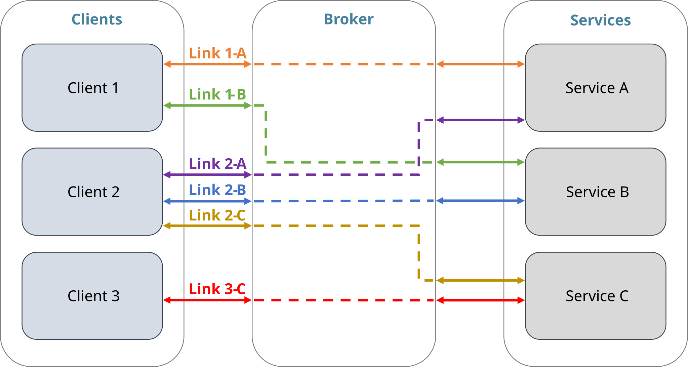

# Overview
`msl-network` uses concurrency and asynchronous programming to transfer messages across a network and it is composed of a [Broker][], [Client][]s and [Service][]s with a [Link][] established between a [Client][] and a [Service][].

- ***Broker***
    - Central node in the network.
    - Clients and Services connect to it.
    - Routes messages to the appropriate recipient (Client or Service).

- ***Client***
    - Connects to a Broker.
    - Creates a Link with a Service (a single Client can create multiple links).
    - Sends a request to the Service and receives the reply.
    - Subscribes to messages that are published by the Service.

- ***Service***
    - Connects to a Broker.
    - Processes a request from a Client and sends the reply.
    - Publishes messages to all subscribed Clients.



Messages are transferred using [ZeroMQ](https://zeromq.org/) sockets. As such, the order in which you run a Broker, Client or Service does not matter. A Service can connect to a Broker that has not started yet and when the Broker does start running it will register the Service as being available for Clients to interact with. When a Service disconnects, the Broker unregisters it. A Client can connect to a Broker that has not started yet and it can link with a Service that is not available yet, but it cannot get a reply from the Service until the Service is running to process the request.

Any programming language that has a ZeroMQ [binding](http://wiki.zeromq.org/bindings:_start) available can be used to implement a Client or a Service. So a Client written in Python could be requesting a Service written in C++ to process the request (or vice versa).

## Broker
A Broker is the central node in the network and acts as a message proxy. Running a single Broker instance can support many [Client][]s and [Service][]s connected to it simultaneously. The Broker routes a [Client][]'s request to the appropriate [Service][] and sends the [Service][]'s reply back to the [Client][] (ZeroMQ REQ-REP pattern). A Broker also distributes a message published by a [Service][] to all [Client][]'s that are subscribed (ZeroMQ PUB-SUB pattern). A message is routed as soon as possible once it is received, a queue is not used. A Broker only checks who the recipient is for a message it receives, it does not do any processing with the content of the message.

There are a few runnable [examples][] that are available when `msl-network` is installed. The [Echo][] example illustrates the ZeroMQ REQ-REP pattern and the [Heartbeat][] example illustrates the ZeroMQ PUB-SUB pattern.

## Message Format
A message (a request, reply or publication) is transferred as bytes, but a [Client][] and [Service][] can control how data is serialised into bytes and whether compression is applied before the bytes are transferred. The serialisation/compression algorithm is controlled by the [Flag][] enumeration value. When a [Client][] or [Service][] receives a message, the message is automatically decompressed and deserialised.

The default serialisation method uses the [pickle][] format with no compression. When using the [pickle][] format to serialise data, it is important that you trust the [Client][]s and [Service][]s that you are transferring messages between.

You can also temporarily change the flag value before sending a request (see [here][msl.network.client.Client.flag_at]) or a reply (see [here][msl.network.service.Service.flag_at]).

## (A)synchronous Requests
A [Client][] can send requests either asynchronously or synchronously (the default). When an asynchronous request is sent, a [Future][concurrent.futures.Future] instance is returned which will eventually contain the reply to the request as the [result][concurrent.futures.Future.result]. When a synchronous request is sent, the reply from the [Service][] is returned.

!!! example
    See the [Echo][] example to [start the Broker][echo-broker] and [start the Service][echo-service] so that you can run the following example script.

    See [here][msl.network.client.Link.__getattr__] for more information about the `sync` keyword argument in the following example script.

```python
from msl.network import Client

with Client() as client:
    # Create a Link with the Echo service
    link = client.link("Echo")

    # sync=True is the default keyword argument when sending a request
    print(link.echo(1))

    # or you could specify it explicitly
    print(link.echo(2, sync=True))

    # send asynchronous requests
    future1 = link.echo(3, sync=False)
    future2 = link.echo(4, sync=False)
    future3 = link.echo(5, sync=False)

    # do other stuff ...

    # get the reply of each request
    print(future1.result())
    print(future2.result())
    print(future3.result())
```

## Service Load Balancing
While a [Service][] is processing a request, it cannot receive another request. If a [Service][] is continuously busy processing requests you can run multiple instances of the [Service][] and the [Broker][] will evenly distribute requests amongst the [Service][]s. You could run an instance of the [Service][] multiple times on the same computer or you could run the [Service][] on multiple computers (a Broker cannot tell the difference and does not care where a [Service][] is connecting from).

## Security
There are five ways in which you can control the security of a device connecting to a [Broker][]. Since security is handled by ZeroMQ sockets, we use the same [mnemonic names](http://hintjens.com/blog:49) commonly used by the ZeroMQ community to illustrate the different ways you can use security in your application. You may also want to read some background information about the [ZeroMQ Authentication Protocol](https://rfc.zeromq.org/spec/27/).

| | Restrict IP addresses | Username/Password Authentication | CURVE Encryption | [Broker][] Verified | [Client][]/[Service][] Verified |
| -------------- | :------: | :------: | :------: | :------: | :------: |
| [Grasslands][] | &#x274C; | &#x274C; | &#x274C; | &#x274C; | &#x274C; |
| [Strawhouse][] | &#x2705; | &#x274C; | &#x274C; | &#x274C; | &#x274C; |
| [Woodhouse][]  | &#x2705; | &#x2705; | &#x274C; | &#x274C; | &#x274C; |
| [Stonehouse][] | &#x2705; | &#x274C; | &#x2705; | &#x2705; | &#x274C; |
| [Ironhouse][]  | &#x2705; | &#x274C; | &#x2705; | &#x2705; | &#x2705; |

### Grasslands
No encryption. No security. This is the default mechanism.

Start a [Broker][] using,
```console
msl-network start
```

and use the default parameters for `curve` and `plain` when creating an instance of a [Client][]/[Service][].

```python
from msl.network import Client

client = Client()
```

### Strawhouse
No encryption. The [Broker][] allows connections from only specific devices, based on the hostname or IP address of the device. This security layer is known as the [NULL](https://rfc.zeromq.org/spec/27/#the-null-mechanism) mechanism.

On the computer that you want to run the [Broker][] on, you can save the devices that are allowed to connect to the [Broker][] in a file,
```console
msl-network device add 192.168.1.10 lab-computer
```

and start a [Broker][] with the devices read from the file.
```console
msl-network start --auth-device
```

Alternatively, you can specify the devices directly when starting the [Broker][] (which will not read the devices from the file).
```console
msl-network start --auth-device 192.168.1.32
```

Use the default parameters for `curve` and `plain` when creating an instance of a [Client][]/[Service][].

```python
from msl.network import Client

client = Client()
```

Run `msl-network device --help` for more details about managing authorised devices.

### Woodhouse
No encryption. The [Broker][] requires a valid username and password for a device to connect. In addition, a [Broker][] may also allow connections from only specific devices (see [Strawhouse][]). This security layer is known as the [PLAIN](https://rfc.zeromq.org/spec/27/#the-plain-mechanism) mechanism.

!!! warning
    A username and password is sent in *plain* text through the network. Use this security mechanism only on trusted networks.

Save the usernames and passwords of authorised users to a file,
```console
msl-network plain add --username me --password secret
msl-network plain add --username you --password danger
```

and start a [Broker][] with the usernames and passwords read from a file.
```console
msl-network start --auth-plain
```

Specify the `plain` parameter when creating an instance of a [Client][]/[Service][].

```python
from msl.network import AuthPlain, Client

# Either specify the values directly in your code
auth = AuthPlain(username="me", password="secret")

# or you can load the values from a file
auth = AuthPlain.load("~/auth.txt")

client = Client(plain=auth)
```

Run `msl-network plain --help` for more details about managing usernames and passwords.

### Stonehouse
Messages are encrypted with [elliptic-curve](https://rfc.zeromq.org/spec/26/) cryptography. A [Client][]/[Service][] verifies the public certificate of a [Broker][] (one-way verification). In addition, a [Broker][] may also allow connections from only specific devices (see [Strawhouse][]). This security layer is known as the [CURVE](https://rfc.zeromq.org/spec/27/#the-curve-mechanism) mechanism.

Create CURVE certificates on the computer running the [Broker][],
```console
msl-network curve
```

and start a [Broker][] with the certificates loaded.
```console
msl-network start --auth-curve
```

Copy the [Broker][]'s public certificate to a computer connecting as a [Client][]/[Service][] and specify the `curve` parameter when creating an instance of a [Client][]/[Service][].

```python
from msl.network import AuthCurve, Client

# Load the public CURVE certificate of the Broker
auth = AuthCurve.load("~/.curve/broker.key")

client = Client(curve=auth)
```

Run `msl-network curve --help` for more details about creating CURVE certificates.

### Ironhouse
Messages are encrypted with [elliptic-curve](https://rfc.zeromq.org/spec/26/) cryptography. The [Broker][] verifies the public certificate of a [Client][]/[Service][] and a [Client][]/[Service][] verifies the public certificate of the [Broker][] (two-way verification). In addition, a [Broker][] may also allow connections from only specific devices (see [Strawhouse][]). This security layer is (also) known as the [CURVE](https://rfc.zeromq.org/spec/27/#the-curve-mechanism) mechanism.

Create CURVE certificates on the computer running the [Broker][] and also on the computer connecting as a [Client][]/[Service][].
```console
msl-network curve
```

Copy a [Client][]/[Service][]'s public certificate to the `~/.curve` directory on the computer running the [Broker][] and start a [Broker][] with the certificates loaded.
```console
msl-network start --auth-curve
```

Copy the [Broker][]'s public certificate to a computer connecting as a [Client][]/[Service][] and specify the `curve` parameter when creating an instance of a [Client][]/[Service][].

```python
from msl.network import AuthCurve, Client

# Load the public CURVE certificate of the Broker
auth = AuthCurve.load("~/.curve/broker.key")

client = Client(curve=auth)
```

Run `msl-network curve --help` for more details about creating CURVE certificates.
